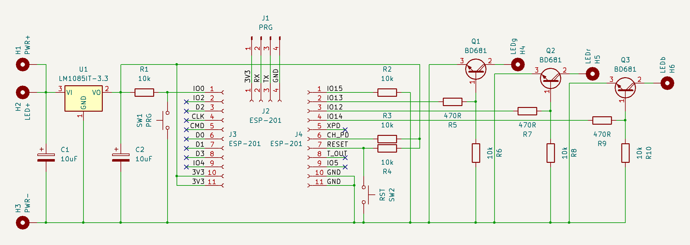
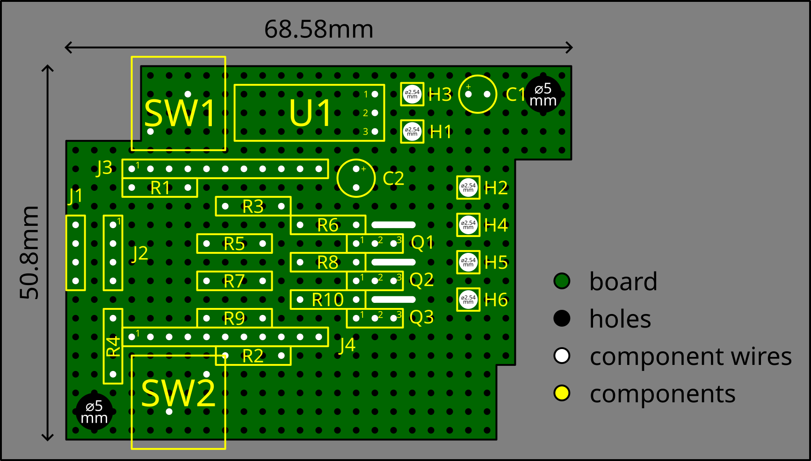
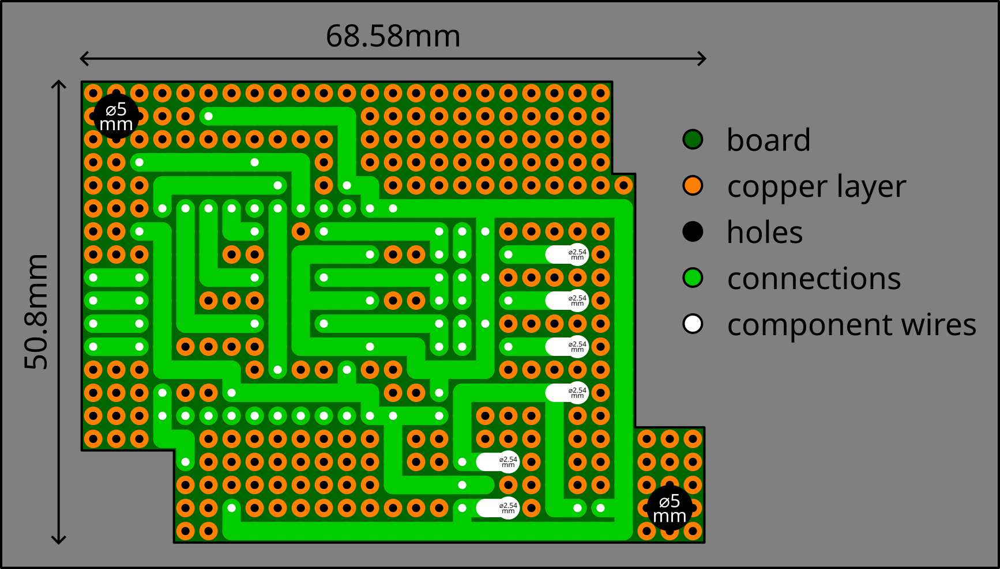
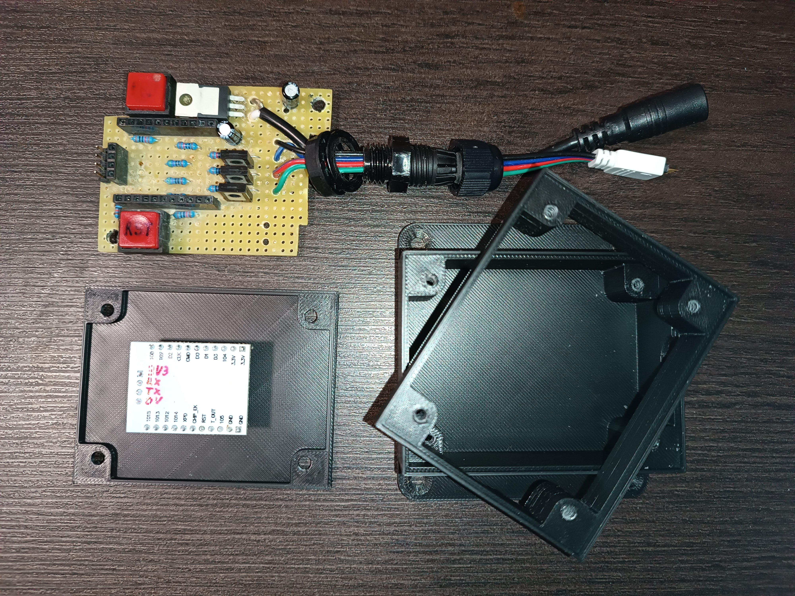
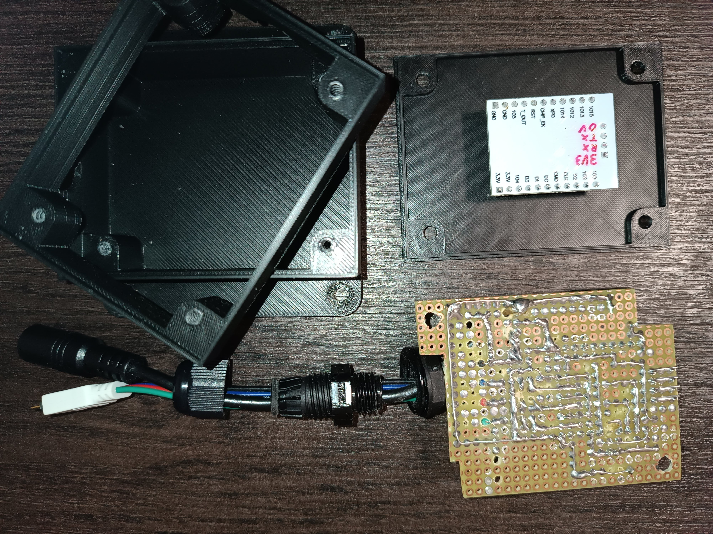
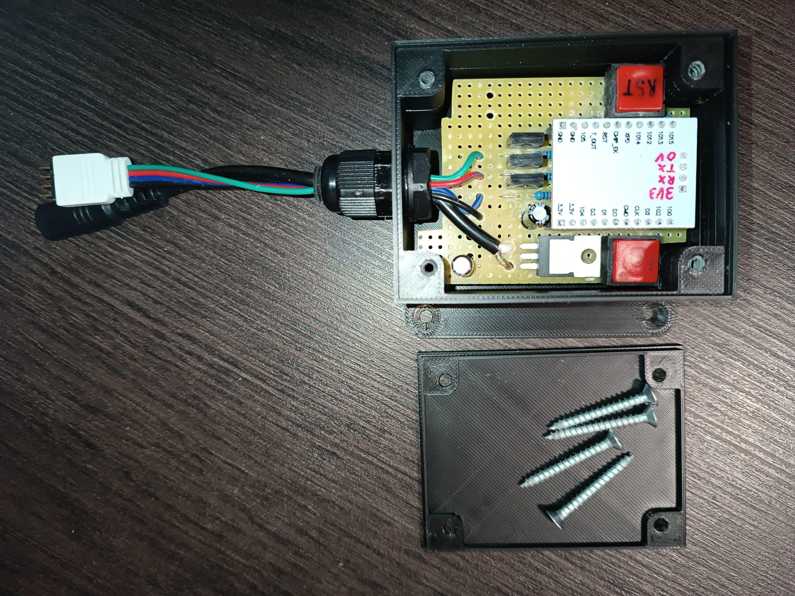
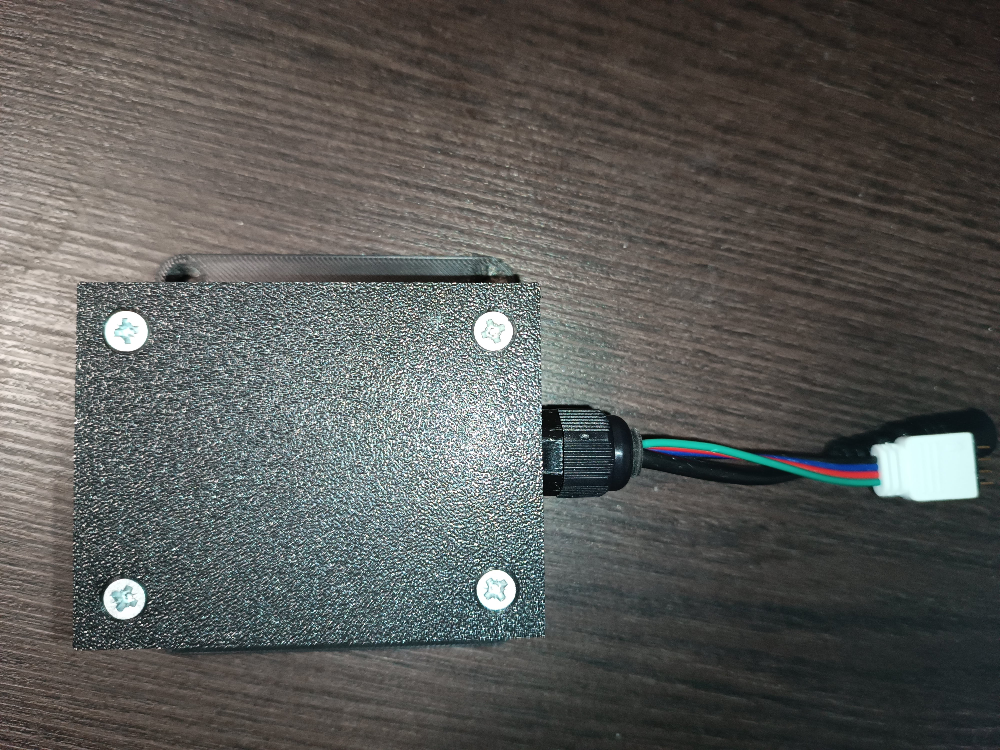
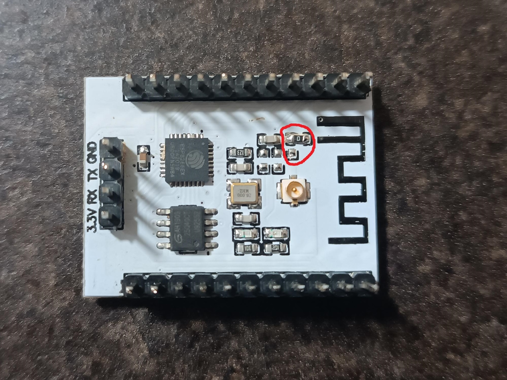

# LED strip controller

This is the documentation of LED strip controller, a device to control LED strip via WiFi/MQTT using ESP8266/ESP-201.

The following steps describe the hardware build and the software intallation of the device.

## Hardware build

The controller consists of an ESP-201 module with additional electronic components allowing the module to control the LED strip. Below, you can see the controller circuit scheme (also available in the `.kicad_sch` format):

In addition to control, the controller is also used to power the LED strip. The used components (resistors and Darlington transistors) allows to supply the LED strip up to 4A for each color. By replacing the voltage regulator `U1` and other components, it's possible to supply the LED strip with higher voltage and current. Buttons `PRG` and `RST` are added to ESP-201 to simply enable programming mode and device resetting.

Below, you can see both sides of the controller PCB design (also available in the `.svg` format, the design uses an universal drilled PCB with 2.54mm hole pitch):

The repository also includes printable 3D models (`.stl` files) of cases for the PCB. For assembling the case, you need 4 additional screws (e.g. 3.5×30mm screws) and a cable gland M12×1.5 needs to be used. Contrary to V1, V2 has additional mounts on the wall or furniture. 

Below, you can see an example of the built hardware:

**Note:** The ESP-201 module needed to be modified. The manufacturer places headers on the opposite side to where the components are soldered. I removed the headers and soldered them to the opposite side so that the entire device would fit in the case. In this example, I also use the internal antenne instead of the external. The selection is done by resoldering the 0Ω resitor:

## Software installation

1. Open the `led-strip-controller.ino` file using the Arduino IDE.

2. Customize the configuration part:
   - Static IP configuration:
     - `ip`: The static IP of the LED strip controller.
	 - `gateway`: The router's IP address.
	 - `subnet`: The local network subnet mask.
	 - `primaryDns` and `secondaryDns`: The DNS servers' IP addresses, only the primary DNS is mandatory, use `secondaryDns(0)` to skip it.
   - WiFi client configuration:
     - `wifiSsid`: The WiFi network identifier.
	 - `wifiPassword`: The WiFi network password.
	 - `wifiUseBssid`: Set `true` to connect the LED strip controller to a specific WiFi router based on its MAC address (BSSID). Otherwise, set `false`.
	 - `wifiBssid`: The WiFi router's MAC address (BSSID). In case it's not used (`wifiUseBssid = false`), it could be anything (e.g. `{ 0x00, 0x00, 0x00, 0x00, 0x00, 0x00 }`).
   - MQTT client configuration:
     - `mqttBroker`: The MQTT broker's address.
	 - `mqttAnonymous`: Set `true` in case you want to use the anonymous access to the broker. Otherwise, set `false`.
	 - `mqttUsername` and `mqttPassword`: In case of the non-anonymous access, set the username and the password.
	 - `mqttPort`: The MQTT server port.
	 - `mqttClientId`: The MQTT client identifier of the LED strip controller.
	 - `mqttDeviceTopic`: The topic used for reporting the LED strip controller state.
	 - `mqttLedStripTopic`: The topic used for controlling the LED strip.
	 - `mqttUseSsl`: Set `true` in case you want to use the secure MQTT connection. Otherwise, set `false`.
	 - `mqttCaCert`, `mqttClientCert` and `mqttClientKey`: Set the CA certificate, the client public certificate and the client key using the Base64-encoded DER format.
   - NTP client configuration:
     - `ntpServer`: Set the NTP server IP to sync the LED strip controller's time.
   - LED pin configuration: In case you build the hardware according to the scheme above, don't change it. Otherwise, you need to adjust it to your solution. :-)

3. Connect the LED strip controller using a USB-UART adapter supporting ESP8266 to a computer holding the `PRG` button.

4. Flash the customized program.

## Usage

After the connection to the MQTT server, the LED strip controller sends the device state and the LED strip state every 15 seconds using the `device-topic/state` topic.

The device state contains the following data:
- `coreVersion`
- `cpuFrequency` (in megahertz)
- `flashChipSize` (in bytes)
- `flashChipFrequency` (in hertz)
- `programSize` (in bytes)
- `freeStackSize` (in bytes)
- `freeHeapSize` (in bytes)
- `maxFreeHeapBlockSize` (in bytes)
- `heapFragmentation` (in bytes)
- `uptime` (using the format `(W'w')(D'd')HH:MI:SS`)
- `timestamp` (Unix time in seconds)

The LED strip controller also sends the LED strip state every 15 senconds using the `led-strip-topic/state` topic.

The device state contains the following data:
- `on` (a boolean value indicating if the LED strip is or or not)
- `brightness` (in percent, integer value)
- `color` (in the `#rrggbb` format)
- `timestamp` (Unix time in seconds)

You can set the LED strip on or off using the `led-strip-topic/on` topic and the payload `{"value": true/false}`. Non-boolean values are ignored.

You can set the LED strip brightness using the `led-strip-topic/brightness` topic and the payload `{"value": 0-100}`. Any value lower then 0 is interpreted as 0, any value grater than 100 is interpreted as 100. Non-integer values are ignored.

You can set the LED strip color using the `led-strip-topic/color` topic and the payload `{"value": "#rgb/#rrggbb"}`. Invalid values are ignored.

## Authors

- [**Eli Nucknack**](mailto:eli.nucknack@gmail.com)
