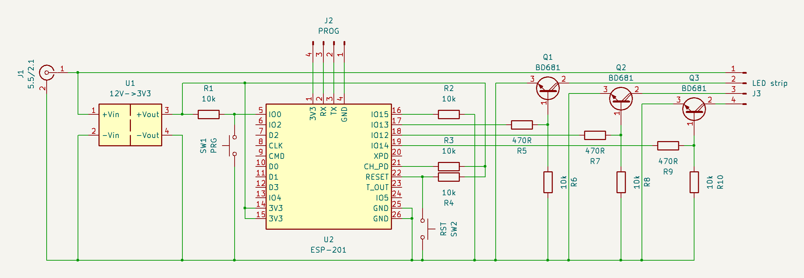
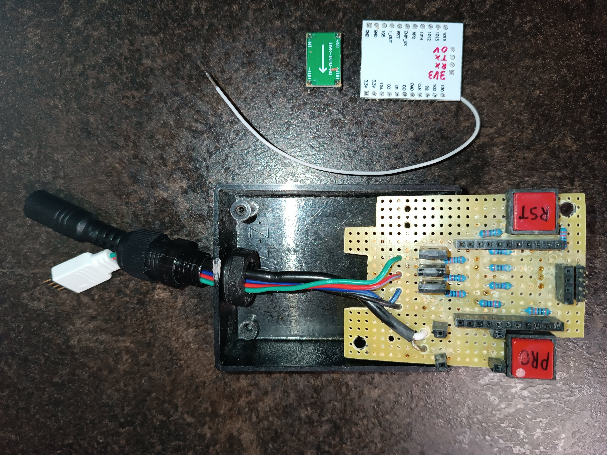
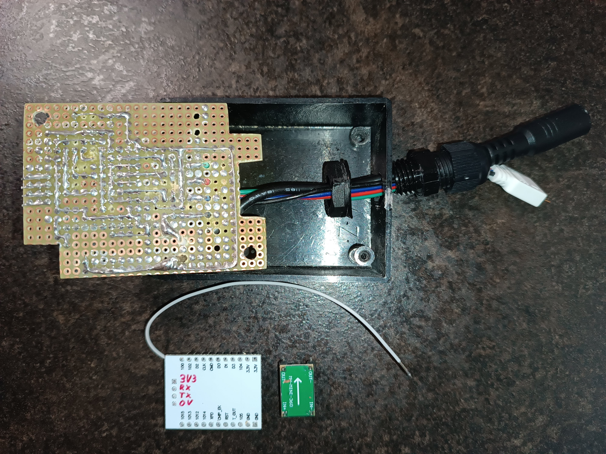

# LED strip controller

This is the documentation of LED strip controller, a device to control LED strip via WiFi/MQTT using ESP8266/ESP-201.

The following steps describe the hardware build and the software intallation of the device.

## Hardware build

The controller consists of an ESP-201 module with additional electronic components allowing the module to control the LED strip. You can see the controller scheme below:

**Note:** The scheme is also available in the `.kicad_sch` format (editable in the KiCad program).

In addition to control, the controller is also used to power the LED strip. The used components (resistors and Darlington transistors) allows to supply the LED strip up to 4A for each color. By replacing the voltage regulator `U1` and other components, it's possible to supply the LED strip with higher voltage and current. Buttons `PRG` and `RST` are added to ESP-201 to simply enable programming mode and device resetting.

You can see an example of the built hardware using universal drilled PCB:

**Note:** The ESP-201 module needed to be modified. The manufacturer places headers on the opposite side to where the components are soldered. I removed the headers and soldered them to the opposite side so that the entire device would fit in the box. In this example, I also use the internal antenne instead of the external. The selection is done by resoldering the 0Ω resitor:

## Software installation

1. Open the `led-strip-controller.ino` file using the Arduino IDE program.

2. Customize the configuration part.

3. Connect the LED strip controller using a USB-UART adapter supporting ESP8266 to a computer holding the `PRG` button.

4. Flash the customized program.

## Authors

- [**Eli Nucknack**](mailto:eli.nucknack@gmail.com)
