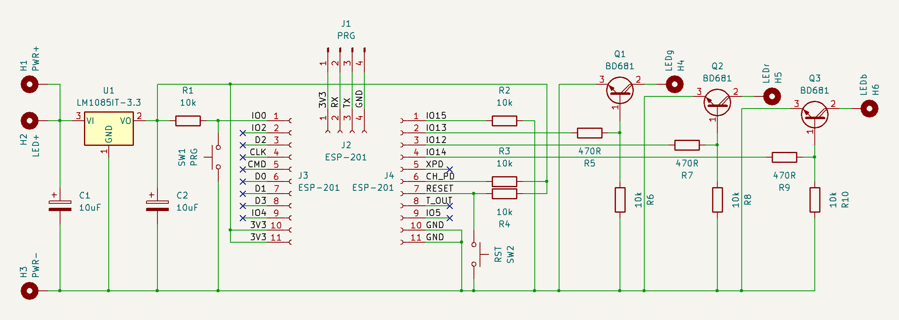
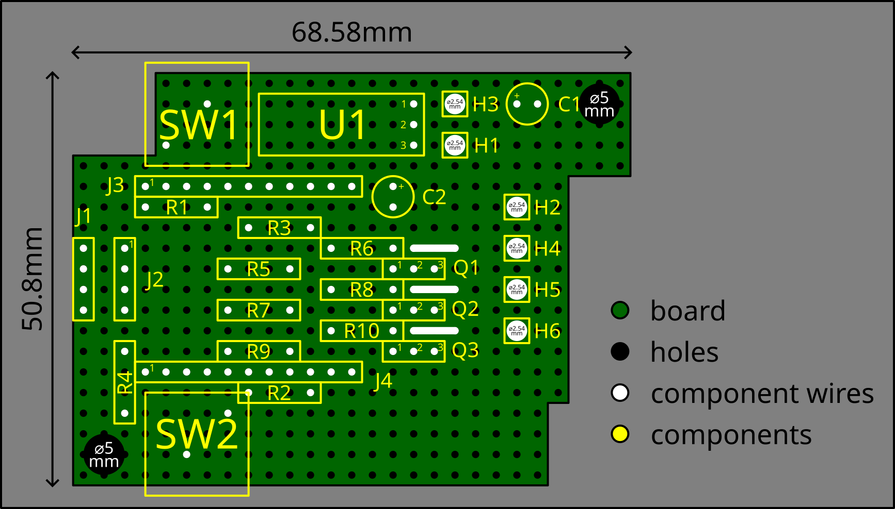
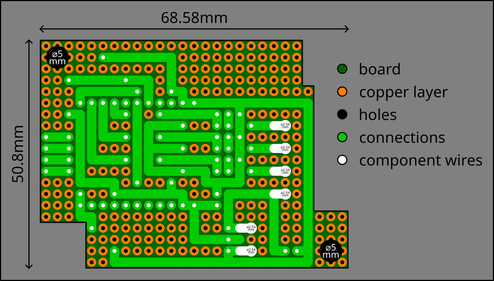
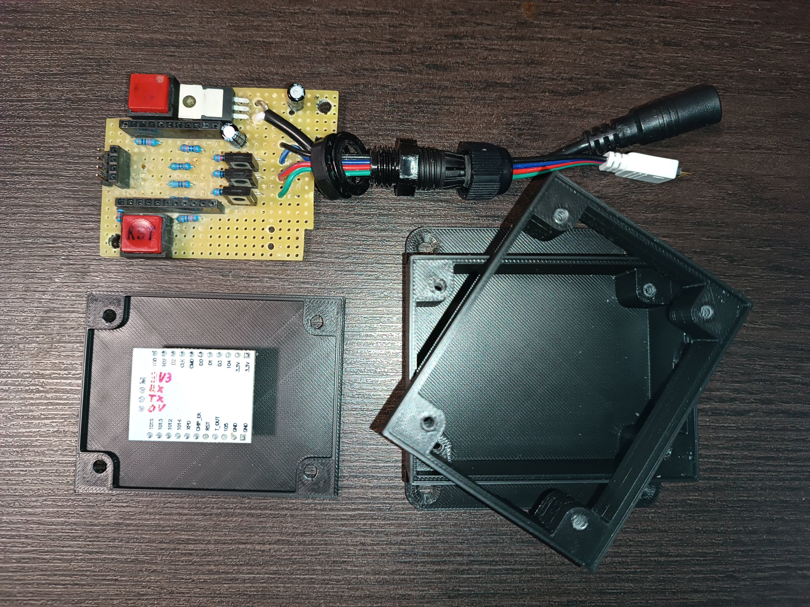
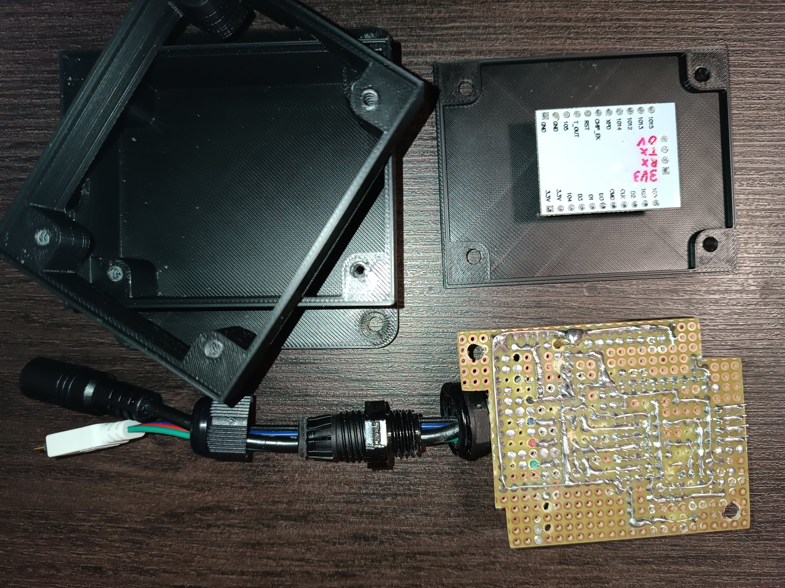
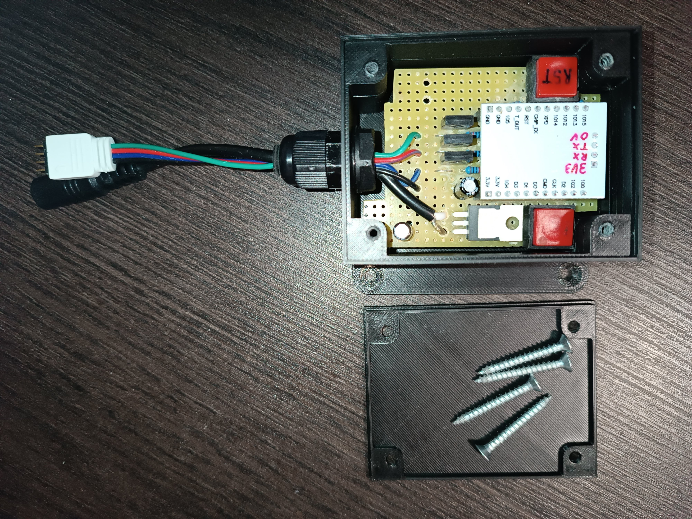
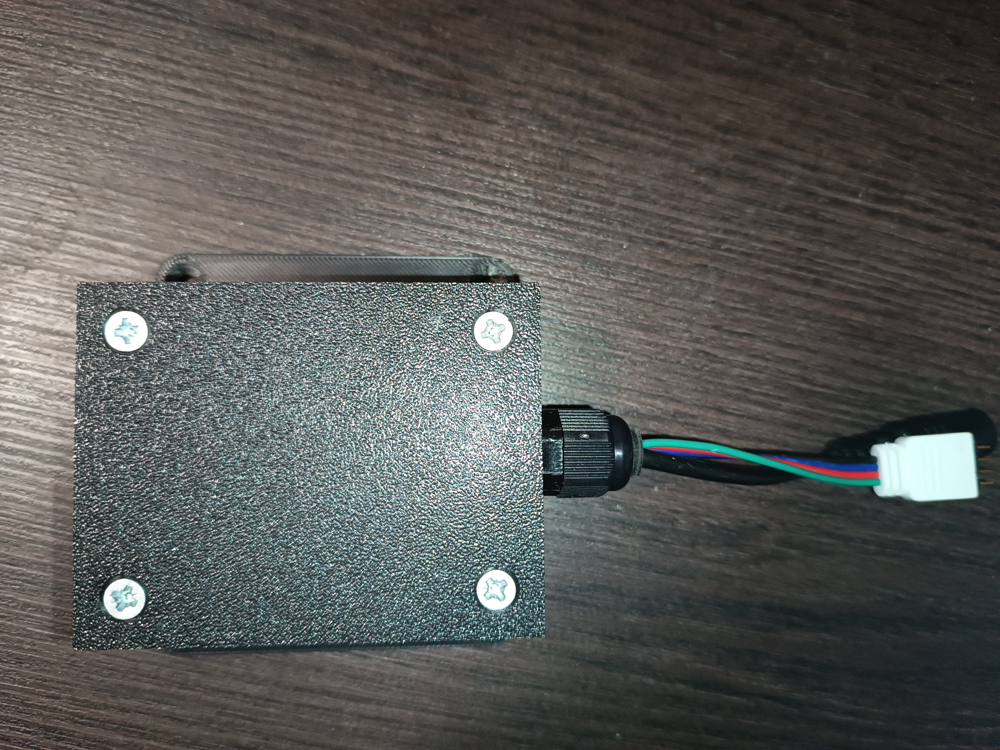
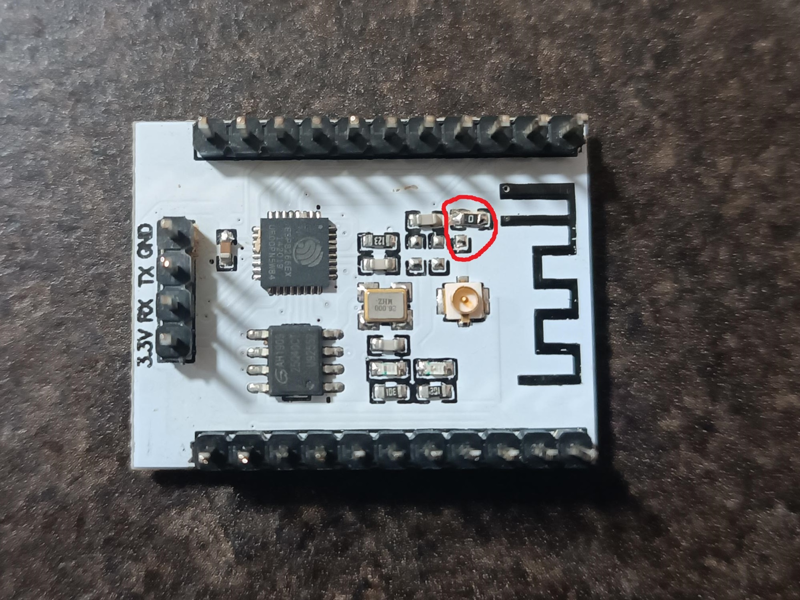

# LED strip controller

This is the documentation of LED strip controller, a device to control an RGB LED strip via WiFi/MQTT using the ESP-201 module.

The following steps describe the hardware build and the software installation of the device.

## Hardware build

The controller consists of an ESP-201 module with additional electronic components allowing the module to control the LED strip. Below, you can see the controller circuit scheme (also available in the `.kicad_sch` format):

In addition to control, the controller is also used to power the LED strip. The used components (resistors and Darlington transistors) allow to supply the LED strip up to 4A for each color. By replacing the voltage regulator `U1` and other components, it's possible to supply the LED strip with higher voltage and current. Buttons `PRG` and `RST` are added to simply enable programming mode and device resetting.

Below, you can see both sides of the controller PCB design (also available in the `.svg` format, the design uses an universal drilled PCB with 2.54mm hole pitch):

The repository also includes printable 3D models (`.stl` files) of cases for the PCB. To assemble the case, you need 4 3.5×30mm screws and a cable gland M12×1.5 needs to be used. Contrary to V1, V2 has additional mounts on the wall or furniture. 

Below, you can see an example of the built hardware:

**Note:** The ESP-201 module headers might need adjustment depending on your case layout to ensure that the entire device fits properly. In this example, an internal antenna is used instead of the external one. The selection is done by resoldering the 0Ω resistor:

## Software installation

1. Open the `led-strip-controller.ino` file using the Arduino IDE.

2. Customize the configuration part:
   - **Static IP configuration:**
     - `ip`: The static IP of the LED strip controller.
     - `gateway`: The router's IP address.
     - `subnet`: The local network subnet mask.
     - `primaryDns` and `secondaryDns`: The DNS servers' IP addresses, only the primary DNS is mandatory, use `secondaryDns(0)` to skip it.
   - **WiFi client configuration:**
     - `wifiSsid`: The WiFi network identifier.
     - `wifiPassword`: The WiFi network password.
     - `wifiUseBssid`: Set to `true` to connect the LED strip controller to a specific WiFi router based on its MAC address (BSSID). Otherwise, set `false`.
     - `wifiBssid`: The WiFi router's MAC address (BSSID). In case it's not used (`wifiUseBssid = false`), it could be anything (e.g. `{ 0x00, 0x00, 0x00, 0x00, 0x00, 0x00 }`).
   - **MQTT client configuration:**
     - `mqttBroker`: The MQTT broker's address.
     - `mqttAnonymous`: Set to `true` in case you want to use anonymous access to the broker. Otherwise, set `false`.
     - `mqttUsername` and `mqttPassword`: In case of non-anonymous access, set the username and the password.
     - `mqttPort`: The MQTT server port.
     - `mqttClientId`: The MQTT client identifier of the LED strip controller.
     - `mqttDeviceTopic`: The topic used for reporting the LED strip controller state and telemetry.
     - `mqttLedStripTopic`: The topic prefix used for controlling the LED strip.
     - `mqttUseSsl`: Set to `true` in case you want to use a secure MQTT connection. Otherwise, set `false`.
     - `mqttCaCert`, `mqttClientCert` and `mqttClientKey`: Set the CA certificate, the client public certificate, and the client private key using the **PEM format**.
   - **NTP client configuration:**
     - `ntpServer`: Set the NTP server IP to sync the LED strip controller's time.
   - **LED pin configuration:** The default pins are `12` (Red), `13` (Green), and `14` (Blue). Adjust these if your hardware layout differs.

3. Connect the LED strip controller using a USB-UART adapter supporting ESP8266 to a computer while holding the `PRG` button.

4. Flash the customized program.

## Usage

### MQTT Topics & Data Structures

#### Device Metadata
Sent every **60 minutes** to `mqttDeviceTopic/metadata` with the `retain` flag set to `true`.
- `coreVersion`: ESP8266 core version.
- `cpuFrequency`: CPU frequency (in MHz).
- `flashChipSize`: Flash chip size (in bytes).
- `flashChipFrequency`: Flash chip speed (in Hz).
- `programSize`: Sketch size (in bytes).
- `timestamp`: Current Unix timestamp (rounded down to minutes).

#### Device Telemetry
Sent every **60 seconds** to `mqttDeviceTopic/telemetry` with the `retain` flag set to `true`.
- `freeStackSize`: Free stack size (in bytes).
- `freeHeapSize`: Free heap size (in bytes).
- `maxFreeHeapBlockSize`: Maximum free heap block size (in bytes).
- `heapFragmentation`: Heap fragmentation percentage.
- `uptime`: Device uptime **in seconds**.
- `timestamp`: Current Unix timestamp (rounded down to minutes).

#### LED Strip State
Sent every **60 seconds** (or immediately after a state change) to `mqttLedStripTopic/state` with the `retain` flag set to `true`.
- `on`: Boolean value indicating if the LED strip is on or off.
- `brightness`: Current brightness (integer value, `0-100`).
- `color`: Current hex color code (in `#rrggbb` format).
- `timestamp`: Current Unix timestamp.

### State Initialization
Upon connection to the MQTT broker, the device subscribes to `mqttLedStripTopic/#` with **QoS 1**. 

The controller **strictly waits** until it receives its last saved state from the `mqttLedStripTopic/state` topic before it starts accepting control commands. If no retained state exists on the broker, the device will remain in its default hardcoded boot state (`on: false`, `brightness: 100`, `color: #ffffff`) and won't respond to control topics until a valid JSON state payload is published to the state topic.

### Control Commands
To control the device, publish JSON payloads to the subtopics listed below.

* **Turn On/Off**
    * **Topic:** `mqttLedStripTopic/on`
    * **Payload:** `{"value": true}` or `{"value": false}`
    * *Note:* Invalid JSON or missing values are ignored.

* **Set Brightness**
    * **Topic:** `mqttLedStripTopic/brightness`
    * **Payload:** `{"value": 85}` (integer from `0` to `100`)
    * *Note:* Values outside the `0-100` range are **rejected as invalid** and ignored (no automatic clamping is applied).

* **Set Color**
    * **Topic:** `mqttLedStripTopic/color`
    * **Payload:** `{"value": "#rgb"}` or `{"value": "#rrggbb"}`
    * *Note:* Invalid formats are ignored. Short hex codes (e.g., `#f00`) are automatically expanded to full length (`#ff0000`).

## Authors

- [**Eli Nucknack**](mailto:eli.nucknack@gmail.com)
